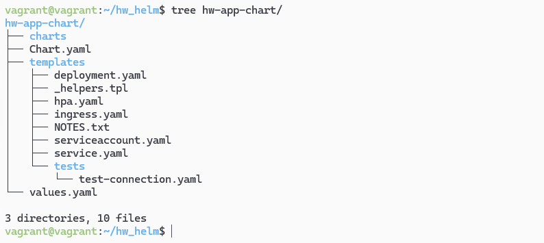
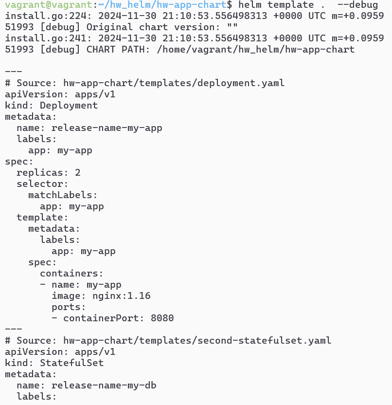
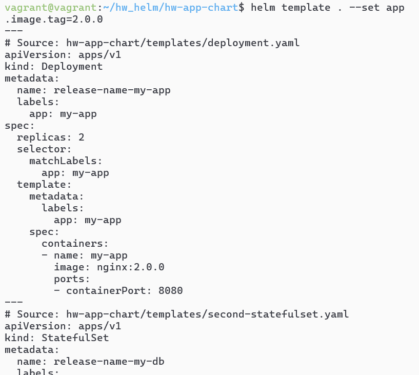
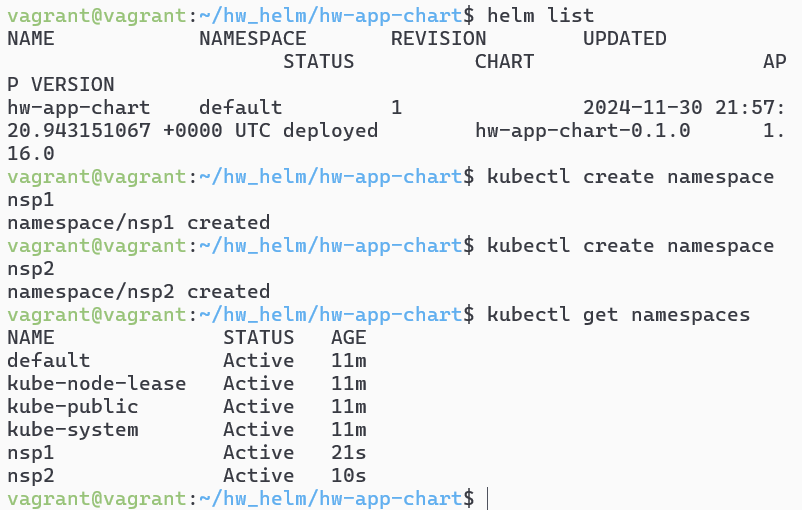
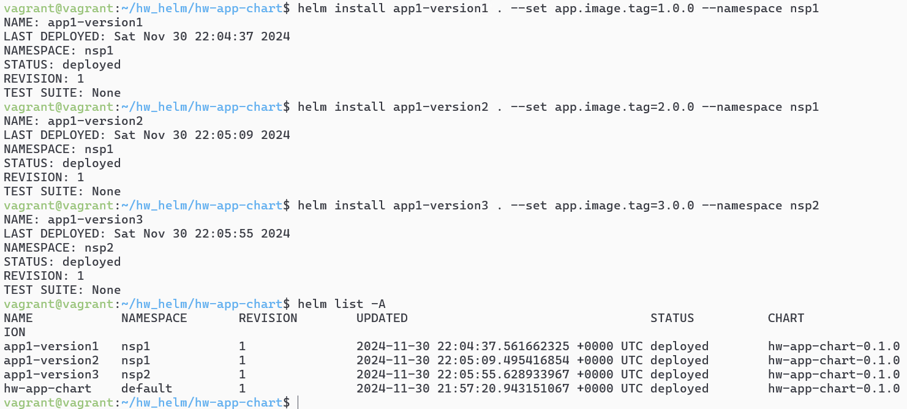

# Домашнее задание к занятию «Helm»- Михалёв Сергей

### Цель задания

В тестовой среде Kubernetes необходимо установить и обновить приложения с помощью Helm.

------

### Инструменты и дополнительные материалы, которые пригодятся для выполнения задания

1. [Инструкция](https://helm.sh/docs/intro/install/) по установке Helm. [Helm completion](https://helm.sh/docs/helm/helm_completion/).

------

### Задание 1. Подготовить Helm-чарт для приложения

1. Необходимо упаковать приложение в чарт для деплоя в разные окружения. 
2. Каждый компонент приложения деплоится отдельным deployment’ом или statefulset’ом.
3. В переменных чарта измените образ приложения для изменения версии.

**Рещение**

Создал новый чарт [hw-app-chart](hw-app-chart).  Структура каталога с базовыми файлами для Helm-чарта:

 

Создал манифесты:
- первый компонент: [deployment.yaml](hw-app-chart/templates/deployment.yaml)
- второй компонент: [second-statefulset.yaml](hw-app-chart/templates/second-statefulset.yaml)
- переменные для обоих манифестов: [values.yaml](hw-app-chart/values.yaml)

Проверка правильности сборки чарта:

 

Mожно напрямую изменить версию образа: `helm install my-app ./hw-app-chart --set app.image.tag=2.0.0`

 

Чтобы деплоить в разные окружения, создал новый файл перемнных [values-prod.yaml](hw-app-chart/values-prod.yaml).

Для запуска чарта в среде prod использую команду `helm install my-app ./hw-app-chart -f values-dev.yaml`

------
### Задание 2. Запустить две версии в разных неймспейсах

1. Подготовив чарт, необходимо его проверить. Запуститe несколько копий приложения.
2. Одну версию в namespace=app1, вторую версию в том же неймспейсе, третью версию в namespace=app2.
3. Продемонстрируйте результат.

**Рещение**

Запустил чарт и создал два namespace.

 

Создал копии приложения: одну версию в namespace=app1, вторую версию в том же неймспейсе, третью версию в namespace=app2.

 